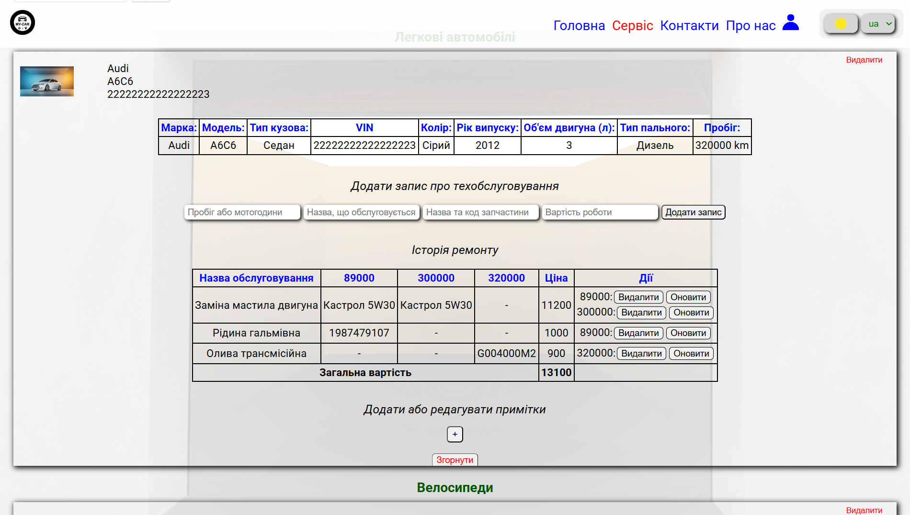
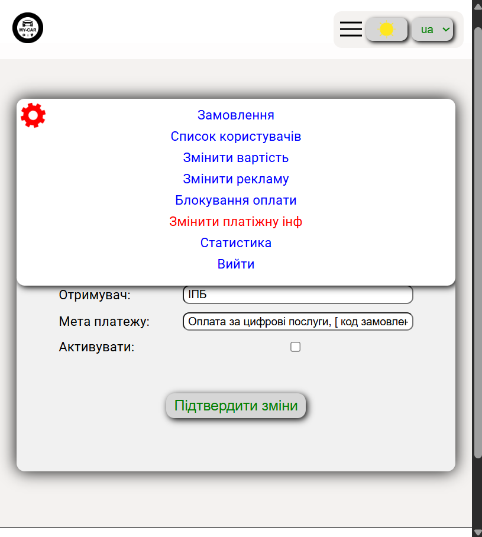
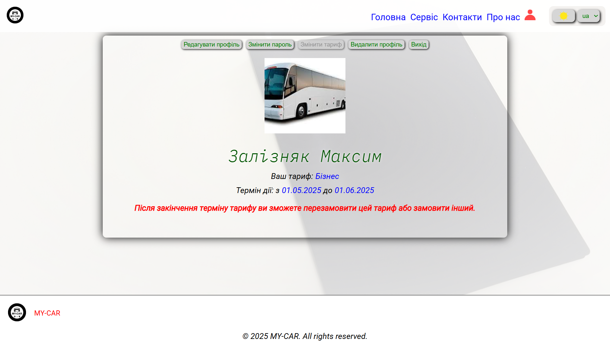

# 🚗 MY-CAR — Online Vehicle Maintenance Tracker

**MY-CAR** is a convenient web application for managing your car's maintenance and repair history. It’s a demo project for my portfolio, fully built from scratch with both frontend and backend components, including admin management tools.

---

## 🔗 Demo

Live demo: **[https://my-car.if.ua](https://my-car.if.ua)**  

---

## 🧰 Main Features

- User registration and authentication
- Personal dashboard with profile editing and account deletion
- Maintenance, repair, and part replacement tracking
- Automatic calculation of total expenses
- Choice between 3 tariff plans (Free / Family / Business)
- Change personal info and password
- Multilingual support (i18n)
- Light/Dark theme toggle

### 🔧 Admin Panel Features

- View and manage users, subscriptions, and site statistics
- Update tariff plan prices
- Manage payment access and restrict features if needed
- Manage advertisement blocks
- Update payment credentials
- Review user-submitted service orders

## 🖼️ UI Screenshots

> 

> 
> 
> 
> 
> 

## 👨‍💻 Tech Stack

### Frontend
- [React](https://reactjs.org/)
- [Redux Toolkit](https://redux-toolkit.js.org/)
- [React Router DOM](https://reactrouter.com/)
- [React Hook Form](https://react-hook-form.com/)
- [i18next](https://www.i18next.com/)
- [Helmet Async](https://github.com/staylor/react-helmet-async)
- [Styled-components](https://styled-components.com/)
- [Vite](https://vitejs.dev/)

### Backend
- [Node.js](https://nodejs.org/)
- [Express](https://expressjs.com/)
- [MySQL](https://www.mysql.com/) with `mysql2`
- [JWT](https://jwt.io/)
- [bcrypt](https://github.com/kelektiv/node.bcrypt.js)
- [Multer](https://github.com/expressjs/multer)
- [Nodemailer](https://nodemailer.com/)
- [node-cron](https://github.com/kelektiv/node-cron)
- [Winston](https://github.com/winstonjs/winston)
- [dotenv](https://github.com/motdotla/dotenv)

### Infrastructure
- VPS (Ubuntu)
- Nginx (as proxy + HTTPS)
- SSL Certificates (Let's Encrypt)
- Server optimization and logging

## 🔒 Paid Features

Payment and tariff switching logic is fully implemented, but disabled in the current version to avoid legal issues. All related functionality is technically complete and ready for activation.

---

> **Note**: This repository is private. If you're interested in the technical implementation or potential collaboration — feel free to contact me.