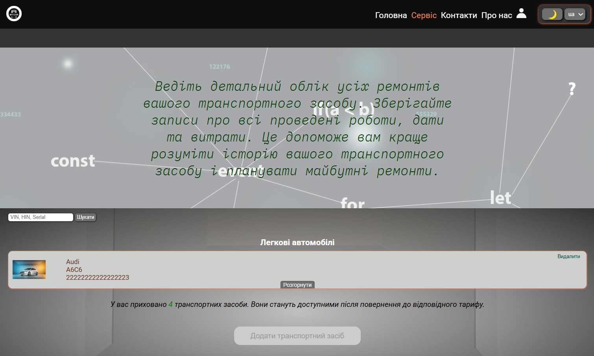
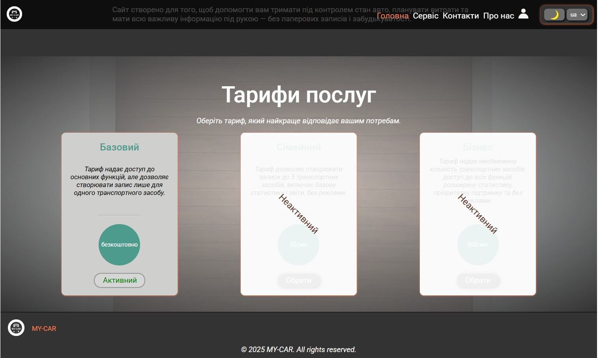
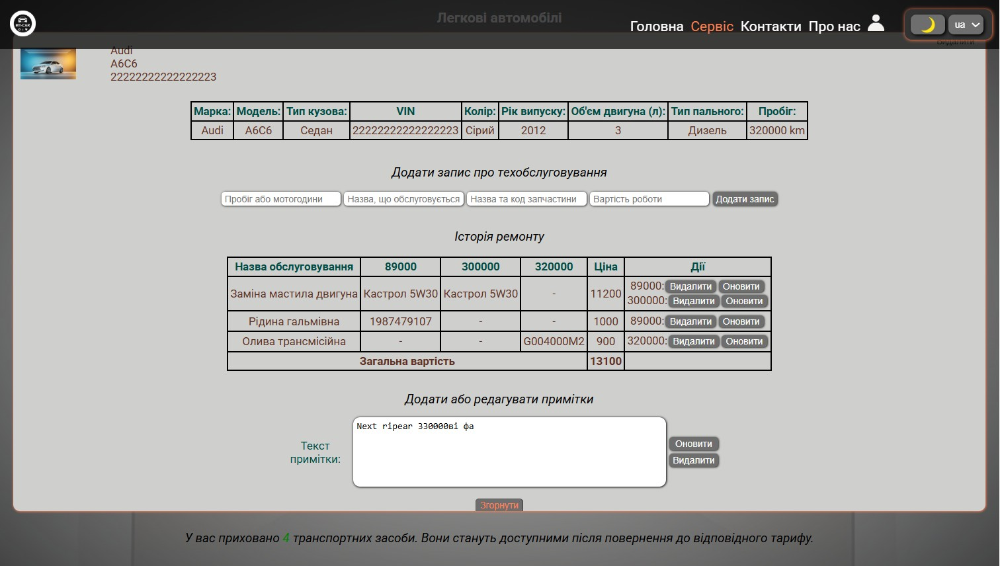
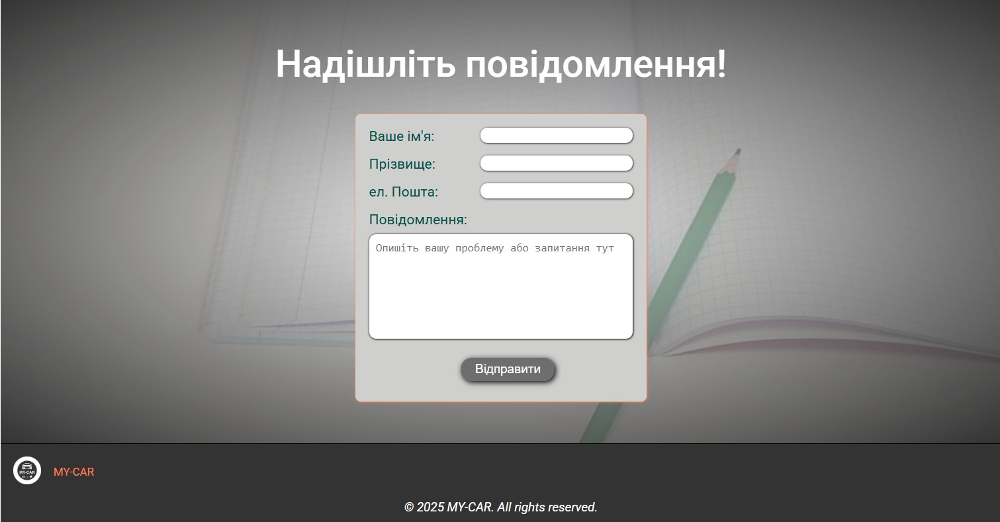
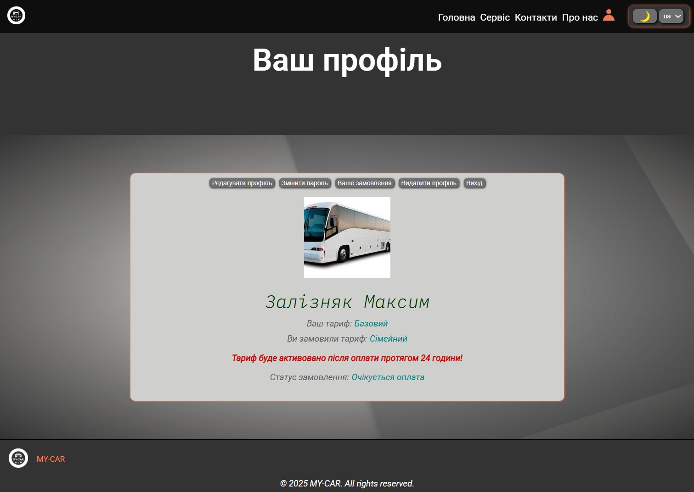
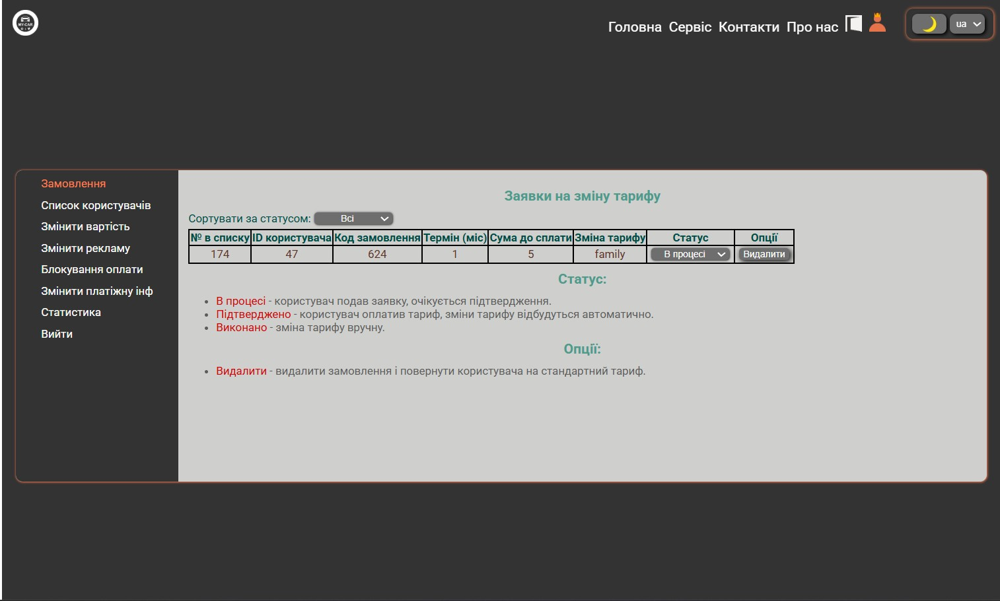

#  MY-CAR — Online Vehicle Maintenance Tracker

**MY-CAR** is a convenient web application for managing your car's maintenance and repair history. This repository contains a public demo version of the project for portfolio purposes, with all sensitive data and private code removed. The full, live application is accessible online.

---

## 🔗 Live Site

The full, live application is accessible here: **[https://my-car.if.ua](https://my-car.if.ua)**  

---

## 🧰 Main Features

- User registration and authentication
- Personal dashboard with profile editing and account deletion
- Maintenance, repair, and part replacement tracking
- Automatic calculation of total expenses
- Choice between 3 tariff plans (Free / Family / Business)
- Change personal info and password
- Multilingual support (i18n)
- Light/Dark theme toggle

### 🔧 Admin Panel Features

- View and manage users, subscriptions, and site statistics
- Update tariff plan prices
- Manage payment access and restrict features if needed
- Manage advertisement blocks
- Update payment credentials
- Review user-submitted service orders

## 👨‍💻 Tech Stack

### Frontend
- [React](https://reactjs.org/)
- [Redux Toolkit](https://redux-toolkit.js.org/)
- [React Router DOM](https://reactrouter.com/)
- [React Hook Form](https://react-hook-form.com/)
- [i18next](https://www.i18next.com/)
- [Helmet Async](https://github.com/staylor/react-helmet-async)
- [Styled-components](https://styled-components.com/)
- [Vite](https://vitejs.dev/)

### Backend
- [Node.js](https://nodejs.org/)
- [Express](https://expressjs.com/)
- [MySQL](https://www.mysql.com/) with `mysql2`
- [JWT](https://jwt.io/)
- [bcrypt](https://github.com/kelektiv/node.bcrypt.js)
- [Multer](https://github.com/expressjs/multer)
- [Nodemailer](https://nodemailer.com/)
- [node-cron](https://github.com/kelektiv/node-cron)
- [Winston](https://github.com/winstonjs/winston)
- [dotenv](https://github.com/motdotla/dotenv)

### Infrastructure
- VPS (Ubuntu)
- Nginx (as proxy + HTTPS)
- SSL Certificates (Let's Encrypt)
- Server optimization and logging

## 🔒 Paid Features

Payment and tariff switching logic is fully implemented, but disabled in the current version to avoid legal issues. All related functionality is technically complete and ready for activation.

---

> **Note**: This repository contains a public demo version of the project. All sensitive data and code not intended for public access have been removed. You can review the structure and implementation of features without any risk of accessing private information.

---

### Screenshot

    

        
        
    

    

        
        
    

    

        
        
    

---

## ⚠️ License / Usage
>This repository contains a **public demo version** of the MY-CAR project for **portfolio and educational purposes only**.  

❌ **You are not allowed to use, copy, redistribute, or deploy this code for commercial or personal projects**.  

For full functionality, visit the live site: [https://my-car.if.ua](https://my-car.if.ua).